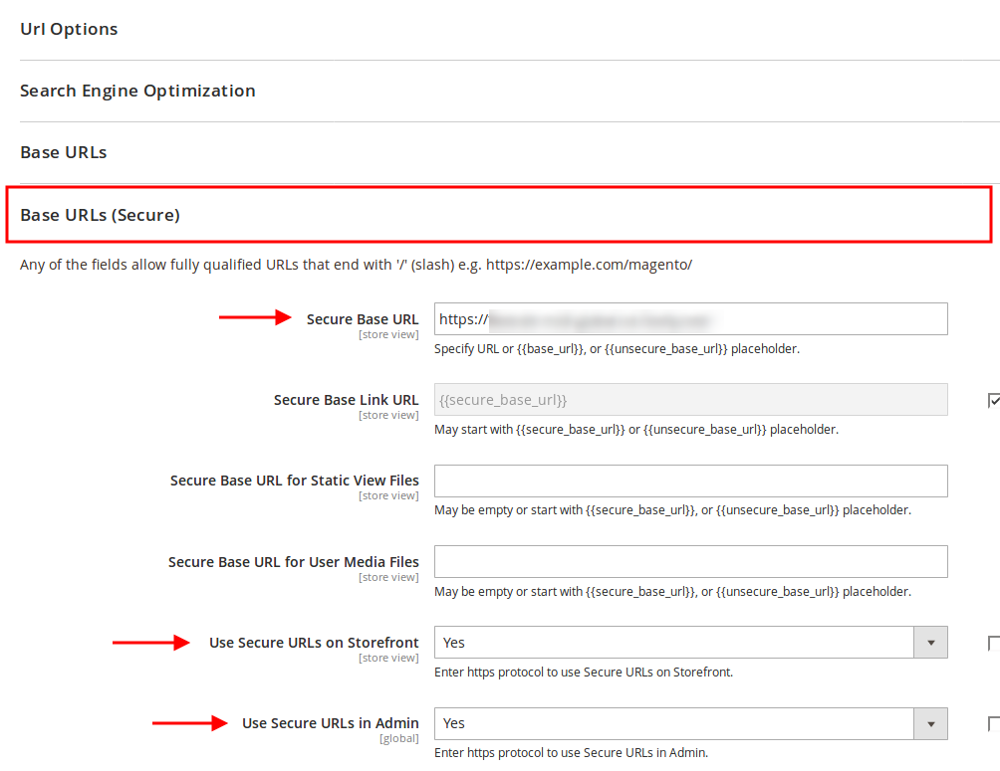
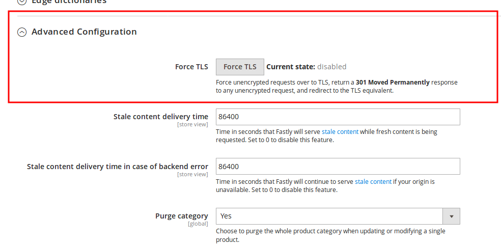
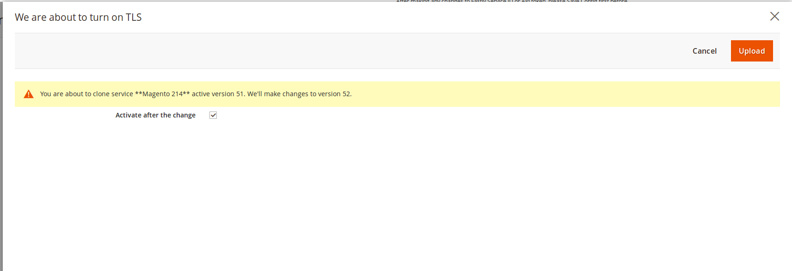

# Force TLS guide

This guide will show how to setup Secure base URL in Magento and turn on Force TLS option. 
For this, you will need to have a TLS certificate. You can read [here](https://docs.fastly.com/en/guides/security#_tls)
on how to order a TLS certificate through Fastly and then set it up.
 
Once your certificate has been deployed on Fastly go to:

```
Magento admin > Stores > Configuration > General > Web
```

Click on the **Base URLs (Secure)** tab and enter your **Secure Base URL**. Also, set **Use Secure URLs in Frontend** and **Use Secure URLs in Admin** options to **Yes**.


 
Once you're done, press the Save config button in the upper right corner.

### Allowing only TLS connections to your site

If you want to only allow TLS on your site, we have you covered. 
There is an option built into the Fastly module that will allow you to force unencrypted requests over to TLS.
It works by returning a 301 Moved Permanently response to any unencrypted request, which redirects to the TLS equivalent.
For instance, making a request for http://www.example.com/foo.jpeg would redirect to https://www.example.com/foo.jpeg.
In addition we'll set [HSTS headers](https://developer.mozilla.org/en-US/docs/Web/HTTP/Headers/Strict-Transport-Security)
which instruct web users not to even attempt insecure methods.

To enable Force TLS option, go to:

```
Magento admin > Stores > Configuration > Advanced > System > Full Page Cache > Fastly Configuration
```

Under the **Advanced Configuration** tab, press the **Force TLS** button. 



The modal window with the following content will pop up, press the **Upload button** in the upper right corner:



Once done, the modal windows will close and you will see a success message. Also, the current state will change to **enabled**.


